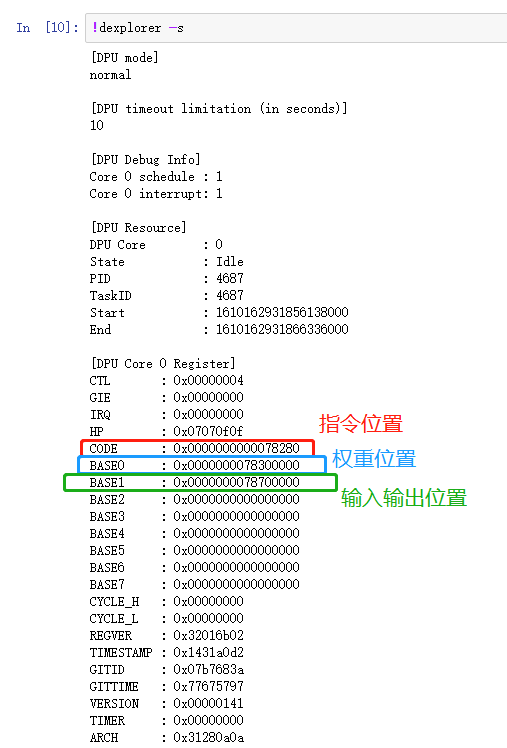

# Xilinx DPU在Baremetal 环境下的部署方案
由于Xilinx DPU目前仅仅只支持在Linux环境下部署，并没有在Baremetal环境下部署的解决方案，因此，本工程通过对Xilinx DPU的运行方式进行分析，探索出Xilinx DPU在Baremetal环境下的部署方案，能够扩展DPU的使用范围，使得嵌入式环境也能利用DPU做一些AI推理工作。该工程目前开源在该连接 <https://github.com/shengwenLeong/Xilinx_DPU_Baremetal>

## 1. 准备环境
本项目主要以Ultra96-V2开发板为主要演示平台，最后部署在Ultra96-V2以及Zynq-7045芯片上进行了验证。
1. Ultra96-V2开发板 + SD card
2. PYNQ v2.4镜像
3. Vivado 2018.2 
4. DPU version: dpu_eu_v3_2_0

## 2. 安装过程(<https://github.com/Xilinx/DPU-PYNQ>)
1. 首先将PYNQ v2.4镜像烧录到SD卡中，然后在启动完成后， 进入Linux系统，运行以下指令，注意最好用USB-Ethernet来连接网络，保证网络的稳定性，避免安装过程中出现断网的情况。
```shell
git clone --recursive --shallow-submodules https://github.com/Xilinx/DPU-PYNQ.git
cd DPU-PYNQ/upgrade
make
```
该更新过程大概持续1小时左右，更新完毕后，则运行以下指令
```shell
pip3 install pynq-dpu
cd $PYNQ_JUPYTER_NOTEBOOKS
pynq get-notebooks pynq-dpu -p .
```
此时，我们可以在Ultra96-V2开发板上通过jupyter notebook来运行DPU

备注：目前DPU-PYNQ已经更新到了PYNQ2.6的版本，部署的环境也更新到Vitis-1.2，大家可以用之前的版本，也可以用新版本。

## 3. 如何从Ultra96-V2开发板上获取DPU运行的神经网络的输入数据，指令，权重参数？
这里我们以caffe版本的mobilenet-V2网络为例，在Ultra96-V2开发板上获取到DPU运行的神经网络的输入数据，指令，以及权重参数。

### 1. DPU的结构
首先，依据对DPU文档和对应的驱动进行分析，我列举出几个与DPU运行相关非常重要的几个寄存器
| 功能 | 偏移地址 | 使能值 | 置位值 |
| :-----:  | :----:  | :----: | :----: |
| 启动DPU运行 | 0x220  | 0x0000_0001  | 0x0000_0000 |
| DRAM上指令的物理地址 | 0x20C | -- | -- |
| DRAM上权重的物理地址 | 0x224 | -- | -- |
| DRAM上输入数据的物理地址 | 0x22C | -- | -- |
| 中断寄存器（完成信号）   | 0x608 | 0x0000_0001 | 0x0000_0000 |

### 2. DPU运行过程探究


如图所示，这里展示了mobilenet-V2网络运行时过程，首先DPU指令相关的参数存放在DRAM的0x38280000位置，网络的偏置/权重参数存放在0x38300000位置，输入数据则从0x38700000位置开始。在DPU运行之前，首先将输入图片数据```224*224*3 = 150528 bytes```放置在0x38700000的位置，此后，DPU开始运行后，将会从上述三个地址取出数据，计算完一层后，将计算结果返回到DRAM中，此时计算结果则存放在输入数据之后，第二层运算开始后，第一层的输入则作为DPU的输入，第一层数据的输出，我个人猜测是返回到0x38700000开始，有可能也不是（后续会进行验证），最终结果，则存放在0x38700500的位置，此时存放的是INT8类型的数据，如果转成浮点数，则需要与一个scale值相乘，该scale值可以在Ultra96-V2上运行

```outputScale = n2cube.dpuGetOutputTensorScale(task, KERNEL_FC_OUTPUT)```

获得，我提供的mobilenet-V2网络的输出数据的scale值为0.25。


注意：最终输入的数据的位置可以通过数值来进行判断，当然也可以通过计算获得，通过计算获得的方案还没有进行完成，后续我将进一步探索该方案，提高部署效率。

### 3. 参数获取步骤
我们在工程里面提供了对应的notebook文件以及memory dump程序来帮助大家运行DPU，并通过memory dump工具来获得DRAM中的数据。

1. 首先，第一次运行我们的notebook,从开始运行到结束，然后利用``` !dexplorer -s ```来获取系统为DPU分配的物理地址，然后释放掉该notebook,则下一次运行该notebook，分配给DPU的物理地址不会发生变化。此时，我们通过``` !dexplorer -s ```可以发现分配给DPU的指令，权重以及输入地址分别为0x78280000, 0x78300000, 0x78700000. 


注意这里指令的地址会出现偏移，因为在Xilinx的驱动里面，这个值也是同样进行了移位，赋值给了该寄存器，因此，实际的物理地址为0x78280000而不是0x00078280. 大家可以在我提供的驱动文件中发现该移位代码


2. 在获取到分配的物理地址后，则可以释放掉该notebook，然后第二次运行notebook,此时，运行notebook只需要到输入数据的位置停止即可.

此时，我们可以利用memdump2file来提取输入图片的数据，具体指令为
```
sudo ./memdump2file 0x78700000 150528
```
这里```150528```为输入数据的大小，即图片的尺寸```224*224*3 = 150528 bytes```
此时，我们可以在memdump2file文件夹中获得dump.bin文件，该文件就是输入数据的二进制文件，可以将其改名为input.bin

3. 获取完输入数据后，此时可以继续运行notebook，然后通过memdump2file工具来获取DPU的指令参数和权重参数,以及最终的运行结果，具体指令为
```
sudo ./memdump2file 0x78280000 524288 
sudo ./memdump2file 0x78300000 4194304 
sudo ./memdump2file 0x78700000 4096
```
这里```524288 = 0x78300000 - 0x78280000, 4194304 = 0x78700000 - 0x78300000 ```
此时生成了两个文件，每次生成完成后，名字都为dump.bin，记得每次运行指令后，将生成的dump.bin改成其他名字。

4. 操作完1，2，3步骤后，我们可以获取到四个文件，这四个文件，我在工程中也同样提供了，分别为
**input.bin, instruction.bin, weight.bin, output.bin** 利用前三个文件，即可在baremetal环境下来实现DPU的正确运行。

### 4. Baremetal 部署过程

1. 此时，我们首先利用vivado2018.2搭建DPU工程，生成bit流以及SDK对应的hdf文件，这里hdf文件我们已经提供在工程中.

2. 将Ultra96 调整为JTAG启动模式，运行Xilinx SDK 2018.2， 利用hdf，创建一个hello world工程, 以及利用我们提供的源文件 将我们提供的源文件进行编译后，首先运行一个简单的hello world工程，此时，利用Xilinx SDK 2018.2提供的工具，点击菜单中的 Xilinx->Dump/Restore Data file 
**input.bin, instruction.bin, weight.bin**三个文件，分别写到DRAM上对应的地址上，这里我设置的地址为0x38700000, 0x38280000, 0x38300000.

3. 写入成功后，可以运行提供的SDK DPU工程，此时可以在putty获取串口打出的数据，当运行完成后，

此时在XSCT Console中利用指令
```
mrd 0x38700500 16
```
即可读出对应的数值，则可以与output.bin中的数值进行比对。此时baremetal环境下利用DPU运行的过程基本就完成了


